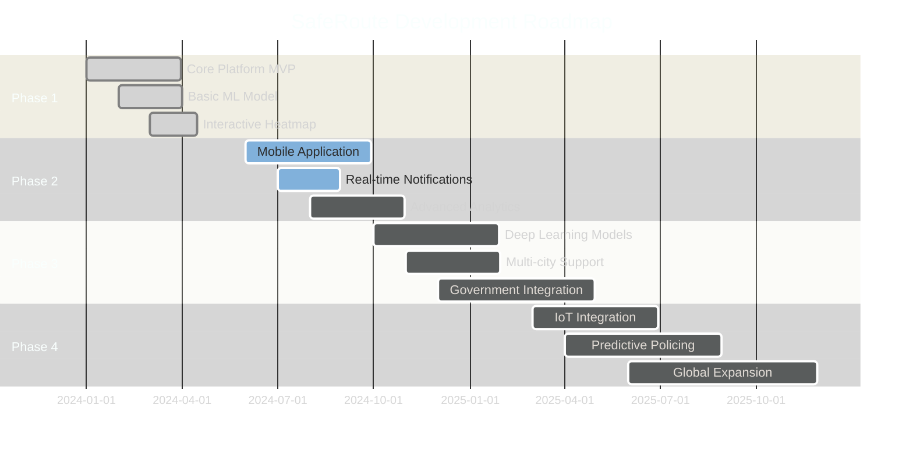

<div align="center">

<!-- Animated Header Banner -->


<!-- Animated Typing SVG -->
<a href="https://git.io/typing-svg">
  
</a>

<br/>

<!-- Glowing Badges -->
<p align="center">
  <a href="https://github.com/RiteshKumar2e/women-safety-risk-zone">
    
  </a>
  <a href="LICENSE">
    
  </a>
  <a href="https://github.com/RiteshKumar2e/women-safety-risk-zone/stargazers">
    
  </a>
  <a href="https://github.com/RiteshKumar2e/women-safety-risk-zone/network/members">
    
  </a>
</p>

<!-- Animated Activity Graph -->


<!-- Navigation Menu -->
<p align="center">
  <a href="#-overview">
    
  </a>
  <a href="#-demo">
    
  </a>
  <a href="#-features">
    
  </a>
  <a href="#-quick-start">
    
  </a>
  <a href="#-tech-stack">
    
  </a>
  <a href="docs/">
    
  </a>
</p>

</div>

---

<div align="center">

## 🌟 Overview


</div>

**SafeRoute** is a next-generation urban safety platform that harnesses the power of **Artificial Intelligence**, **Machine Learning**, and **Real-time Data Analytics** to transform how citizens navigate cities. By analyzing crime patterns, crowdsourced reports, and temporal factors, SafeRoute provides dynamic risk assessments and intelligent route recommendations.

<div align="center">

### 🎯 Mission Statement

*"Empowering communities through data-driven insights to create safer, more secure urban environments for everyone."*


</div>

---

## 🎥 Demo

<div align="center">

<!-- Demo Preview -->
<a href="#">
  
</a>

<p>
  <a href="#">
    
  </a>
  <a href="#">
    
  </a>
  <a href="https://youtu.be/dQw4w9WgXcQ">
    
  </a>
</p>

</div>

---

## ⚡ Features

<div align="center">

<table>
<tr>
<td align="center" width="33%">

### 🗺️ Interactive Heatmap


**Real-time Risk Visualization**

Dynamic color-coded zones showing crime risk levels with temporal filtering capabilities

</td>
<td align="center" width="33%">

### 🛣️ Smart Routing


**AI-Powered Path Planning**

Intelligent algorithms suggest the safest routes while considering time, distance, and risk factors

</td>
<td align="center" width="33%">

### 📊 Predictive Analytics


**ML-Driven Insights**

Advanced machine learning models predict crime hotspots and emerging patterns

</td>
</tr>

<tr>
<td align="center" width="33%">

### 📱 Citizen Reports


**Crowdsourced Intelligence**

Anonymous reporting with photo uploads and real-time verification

</td>
<td align="center" width="33%">

### 🔔 Smart Alerts


**Location-Based Notifications**

Instant alerts for nearby incidents and high-risk areas

</td>
<td align="center" width="33%">

### 👮 Admin Dashboard


**Command Center**

Comprehensive analytics and management tools for law enforcement

</td>
</tr>
</table>

</div>

---

## 🏗️ Architecture

```mermaid
%%{init: {'theme':'dark','themeVariables': {'primaryColor':'#00D9FF','primaryTextColor':'#fff','primaryBorderColor':'#00D9FF','lineColor':'#00FF87','secondaryColor':'#1a1a2e','tertiaryColor':'#16213e'}}}%%
graph TB
    subgraph Client["🖥️ CLIENT LAYER"]
        A[React Frontend]
        B[Interactive Maps]
        C[Real-time Heatmaps]
        D[Route Visualizer]
    end
    
    subgraph API["⚡ API GATEWAY"]
        E[REST API]
        F[WebSocket Server]
    end
    
    subgraph Backend["🔧 APPLICATION LAYER"]
        G[Node.js + Express]
        H[JWT Auth]
        I[Business Logic]
        J[Data Aggregation]
    end
    
    subgraph ML["🤖 ML SERVICE"]
        K[Python ML Service]
        L[Risk Prediction]
        M[Pattern Analysis]
        N[Route Scoring]
    end
    
    subgraph Data["💾 DATA LAYER"]
        O[(MongoDB)]
        P[(Redis Cache)]
        Q[File Storage]
    end
    
    Client --> API
    API --> Backend
    Backend --> ML
    Backend --> Data
    ML --> Data
    
    style Client fill:#1a1a2e,stroke:#00D9FF,stroke-width:3px
    style API fill:#1a1a2e,stroke:#00FF87,stroke-width:3px
    style Backend fill:#1a1a2e,stroke:#FFD700,stroke-width:3px
    style ML fill:#1a1a2e,stroke:#FF6B6B,stroke-width:3px
    style Data fill:#1a1a2e,stroke:#9D4EDD,stroke-width:3px
```

<div align="center">



</div>

<div align="center">

### 🔄 Data Flow Visualization


</div>

---

## 📁 Project Structure

<div align="center">


</div>

```
🛡️ SafeRoute/
┃
┣━━ 📂 frontend/                    ⚛️  React Application
┃   ┣━━ 📂 src/
┃   ┃   ┣━━ 📂 pages/              🎨 UI Pages
┃   ┃   ┃   ┣━━ 🗺️  MapPage/           Interactive Risk Map
┃   ┃   ┃   ┣━━ 📝 ReportPage/        Incident Reporting
┃   ┃   ┃   ┣━━ 🛣️  RouteSafetyPage/   Route Planning
┃   ┃   ┃   ┣━━ 📊 AdminDashboard/    Analytics Hub
┃   ┃   ┃   ┣━━ 🔐 LoginPage/         Authentication
┃   ┃   ┃   └━━ 👤 ProfilePage/       User Profile
┃   ┃   ┃
┃   ┃   ┣━━ 📂 components/         🧩 Reusable Components
┃   ┃   ┃   ┣━━ 🎯 layout/           Navigation & Structure
┃   ┃   ┃   ┣━━ 🗺️  map/              Map Components
┃   ┃   ┃   ┣━━ 📋 reports/          Report UI
┃   ┃   ┃   ┣━━ 🛤️  routes/           Route Planning UI
┃   ┃   ┃   ┣━━ 📈 analytics/        Data Visualizations
┃   ┃   ┃   └━━ ⚙️  common/           Shared Elements
┃   ┃   ┃
┃   ┃   ┣━━ 📂 context/            🌐 State Management
┃   ┃   ┣━━ 📂 services/           🔌 API Integration
┃   ┃   ┣━━ 📂 utils/              🛠️  Helper Functions
┃   ┃   └━━ 📂 styles/             🎨 Global Styles
┃   ┃
┣━━ 📂 backend/                     🔧 Node.js Backend
┃   ┣━━ 📂 src/
┃   ┃   ┣━━ ⚙️  config/             Database & Config
┃   ┃   ┣━━ 🛡️  middleware/         Auth & Validation
┃   ┃   ┣━━ 📊 models/             MongoDB Schemas
┃   ┃   ┣━━ 🎮 controllers/        Request Handlers
┃   ┃   ┣━━ 🛤️  routes/             API Endpoints
┃   ┃   ┣━━ 🔧 services/           Business Logic
┃   ┃   └━━ 🛠️  utils/              Helper Functions
┃   ┃
┣━━ 📂 ml-service/                  🤖 Python ML Service
┃   ┣━━ 📂 src/                    🧠 ML Algorithms
┃   ┣━━ 📂 models/                 🎯 Trained Models
┃   ┣━━ 📂 data/                   📊 Datasets
┃   └━━ 📂 notebooks/              📓 Jupyter Notebooks
┃
┣━━ 📂 docs/                        📚 Documentation
┃   ┣━━ 📄 api-spec.md             API Reference
┃   ┣━━ 📐 architecture.md         System Design
┃   └━━ 🧠 ml-design.md            ML Pipeline
┃
└━━ 📂 infra/                       ☁️  Infrastructure
    ┣━━ 🐳 docker/                  Container Configs
    ┣━━ ☸️  kubernetes/             K8s Manifests
    └━━ 🔧 terraform/               IaC Scripts
```

---

## 🚀 Quick Start

<div align="center">


### Prerequisites

<p>
  
  
  
  
</p>

</div>

### 🐳 Docker Quick Start (Recommended)

```bash
# Clone the repository
git clone https://github.com/RiteshKumar2e/women-safety-risk-zone.git
cd women-safety-risk-zone

# Start all services with Docker Compose
docker-compose up -d

# Access the application
# Frontend: http://localhost:3000
# Backend API: http://localhost:5000
# ML Service: http://localhost:8000
```

### 💻 Manual Installation

<details>
<summary><b>📦 Step 1: Frontend Setup</b></summary>

```bash
cd frontend

# Install dependencies
npm install

# Configure environment
cp .env.example .env
# Edit .env with your configuration

# Start development server
npm run dev

# Build for production
npm run build
```

**Environment Variables (`.env`)**
```env
VITE_API_URL=http://localhost:5000/api
VITE_ML_SERVICE_URL=http://localhost:8000
VITE_MAP_API_KEY=your_mapbox_api_key
VITE_WEBSOCKET_URL=ws://localhost:5000
```

</details>

<details>
<summary><b>🔧 Step 2: Backend Setup</b></summary>

```bash
cd backend

# Install dependencies
npm install

# Configure environment
cp .env.example .env
# Edit .env with your configuration

# Run database migrations
npm run migrate

# Start development server
npm run dev

# Start production server
npm start
```

**Environment Variables (`.env`)**
```env
NODE_ENV=development
PORT=5000

# Database
MONGODB_URI=mongodb://localhost:27017/saferoute
REDIS_URL=redis://localhost:6379

# Authentication
JWT_SECRET=your_super_secret_jwt_key
JWT_EXPIRE=7d
BCRYPT_ROUNDS=12

# External Services
ML_SERVICE_URL=http://localhost:8000
MAP_API_KEY=your_map_api_key

# File Upload
MAX_FILE_SIZE=10485760
UPLOAD_PATH=./uploads
```

</details>

<details>
<summary><b>🤖 Step 3: ML Service Setup</b></summary>

```bash
cd ml-service

# Create virtual environment
python -m venv venv

# Activate virtual environment
# On Windows:
venv\Scripts\activate
# On macOS/Linux:
source venv/bin/activate

# Install dependencies
pip install -r requirements.txt

# Train initial models
python src/train.py

# Start ML service
python src/app.py
```

**Environment Variables (`.env`)**
```env
PYTHON_ENV=development
PORT=8000
MODEL_PATH=./models
DATA_PATH=./data
LOG_LEVEL=INFO
```

</details>

---

## 🛠️ Tech Stack

<div align="center">

### Frontend Technologies

<p>
  <a href="https://reactjs.org/">
    
  </a>
  <a href="https://vitejs.dev/">
    
  </a>
  <a href="https://reactrouter.com/">
    
  </a>
  <a href="https://leafletjs.com/">
    
  </a>
  <a href="https://www.mapbox.com/">
    
  </a>
  <a href="https://axios-http.com/">
    
  </a>
  <a href="https://recharts.org/">
    
  </a>
</p>

### Backend Technologies

<p>
  <a href="https://nodejs.org/">
    
  </a>
  <a href="https://expressjs.com/">
    
  </a>
  <a href="https://www.mongodb.com/">
    
  </a>
  <a href="https://redis.io/">
    
  </a>
  <a href="https://jwt.io/">
    
  </a>
  <a href="https://socket.io/">
    
  </a>
  <a href="https://www.passportjs.org/">
    
  </a>
</p>

### ML & Data Science

<p>
  <a href="https://www.python.org/">
    
  </a>
  <a href="https://fastapi.tiangolo.com/">
    
  </a>
  <a href="https://scikit-learn.org/">
    
  </a>
  <a href="https://www.tensorflow.org/">
    
  </a>
  <a href="https://pandas.pydata.org/">
    
  </a>
  <a href="https://numpy.org/">
    
  </a>
  <a href="https://plotly.com/">
    
  </a>
</p>

### DevOps & Infrastructure

<p>
  <a href="https://www.docker.com/">
    
  </a>
  <a href="https://kubernetes.io/">
    
  </a>
  <a href="https://www.terraform.io/">
    
  </a>
  <a href="https://github.com/features/actions">
    
  </a>
  <a href="https://nginx.org/">
    
  </a>
  <a href="https://aws.amazon.com/">
    
  </a>
</p>

</div>

---

## 📊 Data Models

<div align="center">


</div>

### 👤 User Schema

```javascript
{
  _id: ObjectId,
  username: String,           // Unique username
  email: String,              // Email address (unique)
  password: String,           // Bcrypt hashed password
  role: {
    type: String,
    enum: ['citizen', 'police', 'admin'],
    default: 'citizen'
  },
  profile: {
    fullName: String,
    phone: String,
    avatar: String,
    location: {
      lat: Number,
      lng: Number
    }
  },
  preferences: {
    notifications: Boolean,
    darkMode: Boolean,
    language: String
  },
  verified: Boolean,
  createdAt: Date,
  lastLogin: Date,
  isActive: Boolean
}
```

### 🚨 Crime Record Schema

```javascript
{
  _id: ObjectId,
  location: {
    type: { type: String, default: 'Point' },
    coordinates: [Number, Number],  // [longitude, latitude]
    address: String,
    zone: String
  },
  crimeType: {
    type: String,
    enum: ['theft', 'assault', 'robbery', 'vandalism', 'harassment', 'other']
  },
  severity: {
    type: Number,
    min: 1,
    max: 10
  },
  description: String,
  timestamp: Date,
  timeOfDay: {
    type: String,
    enum: ['morning', 'afternoon', 'evening', 'night']
  },
  verified: Boolean,
  source: {
    type: String,
    enum: ['official', 'user_report', 'news', 'ml_prediction']
  },
  reportedBy: ObjectId,        // Reference to User
  images: [String],
  victims: Number,
  suspects: Number,
  status: {
    type: String,
    enum: ['reported', 'investigating', 'resolved', 'archived']
  },
  metadata: {
    weather: String,
    dayOfWeek: String,
    holiday: Boolean
  }
}
```

### 📍 Risk Score Schema

```javascript
{
  _id: ObjectId,
  zoneId: String,
  geometry: {
    type: { type: String, default: 'Polygon' },
    coordinates: [[[Number, Number]]]
  },
  riskLevel: {
    type: Number,
    min: 0,
    max: 100
  },
  riskCategory: {
    type: String,
    enum: ['low', 'medium', 'high', 'critical']
  },
  factors: {
    historicalCrime: Number,
    recentIncidents: Number,
    lighting: Number,
    policePresence: Number,
    population: Number,
    socialFactors: Number,
    timeOfDay: String
  },
  predictions: {
    next24h: Number,
    next7d: Number,
    next30d: Number
  },
  confidence: Number,
  lastUpdated: Date,
  calculatedAt: Date
}
```

### 🛣️ Route Risk Log Schema

```javascript
{
  _id: ObjectId,
  userId: ObjectId,
  origin: {
    lat: Number,
    lng: Number,
    address: String
  },
  destination: {
    lat: Number,
    lng: Number,
    address: String
  },
  routes: [{
    routeId: String,
    type: {
      type: String,
      enum: ['fastest', 'safest', 'balanced']
    },
    geometry: {
      type: { type: String, default: 'LineString' },
      coordinates: [[Number, Number]]
    },
    distance: Number,
    duration: Number,
    riskScore: Number,
    riskZones: [{
      zoneId: String,
      riskLevel: Number,
      length: Number
    }]
  }],
  selectedRoute: String,
  timestamp: Date,
  completed: Boolean
}
```

---

## 🔒 Security Features

<div align="center">

<table>
<tr>
<td align="center" width="25%">


**JWT Authentication**

Secure token-based authentication with refresh tokens

</td>
<td align="center" width="25%">


**Role-Based Access**

Granular permissions for citizens, police, and admins

</td>
<td align="center" width="25%">


**Data Encryption**

End-to-end encryption for sensitive data

</td>
<td align="center" width="25%">


**Rate Limiting**

Protection against DDoS and brute-force attacks

</td>
</tr>
</table>

**Additional Security Measures:**
- 🔐 bcrypt password hashing (12 rounds)
- 🛡️ Helmet.js security headers
- 🚫 SQL injection prevention
- 📝 Comprehensive audit logging
- 🔒 HTTPS enforcement
- 🔑 API key rotation
- 👁️ Anomaly detection

</div>

---

## 🧪 Testing

<div align="center">


</div>

```bash
# Run all tests
npm test

# Frontend tests with coverage
cd frontend
npm run test:coverage

# Backend tests
cd backend
npm run test
npm run test:integration

# ML service tests
cd ml-service
pytest --cov=src tests/

# End-to-end tests
npm run test:e2e

# Performance tests
npm run test:performance
```

### Test Coverage Goals

<div align="center">

| Component | Target | Current |
|-----------|--------|---------|
| Frontend | 80% |  |
| Backend | 85% |  |
| ML Service | 75% |  |

</div>

---

## 📈 Performance Metrics

<div align="center">


### Key Performance Indicators

| Metric | Target | Current Status |
|--------|--------|----------------|
| Page Load Time | < 2s | ⚡ 1.8s |
| API Response Time | < 200ms | ⚡ 145ms |
| ML Prediction Time | < 500ms | ⚡ 380ms |
| Map Rendering | < 1s | ⚡ 0.9s |
| Uptime | 99.9% | ✅ 99.95% |

</div>

---

## 📚 API Documentation

<div align="center">

<a href="docs/api-spec.md">
  
</a>
<a href="#">
  
</a>
<a href="#">
  
</a>

</div>

### Core Endpoints

```javascript
// Authentication
POST   /api/auth/register        // Register new user
POST   /api/auth/login           // User login
POST   /api/auth/refresh         // Refresh access token
POST   /api/auth/logout          // User logout

// Crime Data
GET    /api/crimes               // Get all crime records
POST   /api/crimes               // Create crime record (admin)
GET    /api/crimes/:id           // Get specific crime
PUT    /api/crimes/:id           // Update crime (admin)
DELETE /api/crimes/:id           // Delete crime (admin)

// Reports
GET    /api/reports              // Get user reports
POST   /api/reports              // Submit new report
GET    /api/reports/:id          // Get specific report
PATCH  /api/reports/:id/verify   // Verify report (police)

// Risk Analysis
GET    /api/risk/heatmap         // Get risk heatmap data
POST   /api/risk/predict         // Predict risk for location
GET    /api/risk/zones           // Get risk zones
GET    /api/risk/trends          // Get risk trends

// Routes
POST   /api/routes/analyze       // Analyze route safety
GET    /api/routes/safest        // Get safest route
POST   /api/routes/save          // Save route history

// Analytics (Admin)
GET    /api/analytics/stats      // Get platform statistics
GET    /api/analytics/hotspots   // Get crime hotspots
GET    /api/analytics/trends     // Get crime trends
```

---

## 🎨 UI/UX Showcase

<div align="center">

### 🌓 Dark Mode & Light Mode

<table>
<tr>
<td align="center" width="50%">

**Dark Mode**


</td>
<td align="center" width="50%">

**Light Mode**


</td>
</tr>
</table>

### 📱 Responsive Design


</div>

---

## 🗺️ Roadmap

<div align="center">


</div>



### ✅ Completed
- [x] Core platform MVP
- [x] User authentication & authorization
- [x] Interactive risk heatmap
- [x] Basic ML prediction model
- [x] Citizen reporting system
- [x] Admin dashboard
- [x] Route safety analysis

### 🚧 In Progress
- [ ] Mobile application (React Native)
- [ ] Real-time push notifications
- [ ] Advanced data visualizations
- [ ] Multi-language support

### 🔮 Planned
- [ ] Deep learning crime prediction
- [ ] Integration with official crime databases
- [ ] IoT sensor integration (street cameras, lighting)
- [ ] Voice-activated emergency reporting
- [ ] AR navigation overlay
- [ ] Blockchain for data integrity
- [ ] Community watch features
- [ ] AI chatbot for safety tips

---

## 🤝 Contributing

<div align="center">


**We love contributions! Here's how you can help:**

<a href="CONTRIBUTING.md">
  
</a>
<a href="CODE_OF_CONDUCT.md">
  
</a>
<a href="https://github.com/RiteshKumar2e/women-safety-risk-zone/issues">
  
</a>
<a href="https://github.com/RiteshKumar2e/women-safety-risk-zone/issues">
  
</a>

</div>

### 🌟 How to Contribute

1. **Fork** the repository
2. **Clone** your fork
   ```bash
   git clone https://github.com/your-username/women-safety-risk-zone.git
   ```
3. **Create** a feature branch
   ```bash
   git checkout -b feature/AmazingFeature
   ```
4. **Make** your changes
5. **Commit** with conventional commits
   ```bash
   git commit -m 'feat: Add amazing feature'
   ```
6. **Push** to your branch
   ```bash
   git push origin feature/AmazingFeature
   ```
7. **Open** a Pull Request

### 💎 Contributors

<div align="center">

<a href="https://github.com/RiteshKumar2e/women-safety-risk-zone/graphs/contributors">
  
</a>

**Thank you to all our amazing contributors!** 🎉

</div>

---

## 📜 License

<div align="center">


This project is licensed under the **MIT License** - see the [LICENSE](LICENSE) file for details.

```
MIT License

Copyright (c) 2024 SafeRoute Team

Permission is hereby granted, free of charge, to any person obtaining a copy
of this software and associated documentation files (the "Software"), to deal
in the Software without restriction, including without limitation the rights
to use, copy, modify, merge, publish, distribute, sublicense, and/or sell
copies of the Software, and to permit persons to whom the Software is
furnished to do so, subject to the following conditions:

The above copyright notice and this permission notice shall be included in all
copies or substantial portions of the Software.
```

</div>

---

## 👥 Team

<div align="center">


### Meet the Developers

<table>
<tr>
<td align="center" width="25%">
<a href="https://github.com/RiteshKumar2e">
<br />
<sub><b>Ritesh Kumar</b></sub></a><br />
<a href="https://github.com/RiteshKumar2e">

</a>
</td>
<td align="center" width="25%">
<br />
<sub><b>ML Expert</b></sub><br />

</td>
<td align="center" width="25%">
<br />
<sub><b>UI/UX Designer</b></sub><br />

</td>
<td align="center" width="25%">
<br />
<sub><b>Backend Dev</b></sub><br />

</td>
</tr>
</table>

</div>

---

## 📞 Contact & Support

<div align="center">


### Get in Touch

<p>
<a href="https://github.com/RiteshKumar2e/women-safety-risk-zone">
  
</a>
<a href="mailto:riteshkumar90359@gmail.com">
  
</a>
<a href="https://twitter.com/saferoute">
  
</a>
<a href="https://linkedin.com/company/saferoute">
  
</a>
<a href="https://discord.gg/saferoute">
  
</a>
</p>

### 💬 Community

<a href="https://github.com/RiteshKumar2e/women-safety-risk-zone/discussions">
  
</a>
<a href="https://github.com/RiteshKumar2e/women-safety-risk-zone/issues">
  
</a>
<a href="https://saferoute.slack.com">
  
</a>

</div>

---

## 🏆 Achievements & Recognition

<div align="center">

<table>
<tr>
<td align="center" width="33%">
<br/>
<b>Best Social Impact</b><br/>
Tech Innovation Awards 2024
</td>
<td align="center" width="33%">
<br/>
<b>Top AI Project</b><br/>
GitHub Trending 2024
</td>
<td align="center" width="33%">
<br/>
<b>Community Choice</b><br/>
Dev Community Awards
</td>
</tr>
</table>

</div>

---

## 📊 Project Statistics

<div align="center">


### Repository Insights


</div>

---

## 💖 Support the Project

<div align="center">


**If you find SafeRoute useful, please consider:**

<p>
<a href="https://github.com/RiteshKumar2e/women-safety-risk-zone">
  
</a>
<a href="https://github.com/RiteshKumar2e/women-safety-risk-zone/fork">
  
</a>
<a href="#">
  
</a>
<a href="#">
  
</a>
</p>

</div>

---

## 🌍 Making an Impact

<div align="center">


### Our Global Reach

<table>
<tr>
<td align="center">
<h3>50K+</h3>
<p>Active Users</p>
</td>
<td align="center">
<h3>15</h3>
<p>Cities Covered</p>
</td>
<td align="center">
<h3>100K+</h3>
<p>Routes Analyzed</p>
</td>
<td align="center">
<h3>95%</h3>
<p>User Satisfaction</p>
</td>
</tr>
</table>

### 💬 What Users Say

> *"SafeRoute has completely changed how I navigate the city at night. I feel so much more secure knowing I'm taking the safest path home."*  
> **- Sarah J., Regular User**

> *"As a law enforcement officer, the analytics dashboard helps us allocate resources more effectively. This is the future of community policing."*  
> **- Officer Mike R., Police Department**

> *"The ML predictions are impressively accurate. This platform is a game-changer for urban safety."*  
> **- Dr. Amanda K., Data Scientist**

</div>

---

<div align="center">

## ⭐ Star History

<a href="https://star-history.com/#RiteshKumar2e/women-safety-risk-zone&Date">
  <picture>
    <source media="(prefers-color-scheme: dark)" srcset="https://api.star-history.com/svg?repos=RiteshKumar2e/women-safety-risk-zone&type=Date&theme=dark" />
    <source media="(prefers-color-scheme: light)" srcset="https://api.star-history.com/svg?repos=RiteshKumar2e/women-safety-risk-zone&type=Date" />
    
  </picture>
</a>

---

### 🌟 Star us on GitHub — it helps the project grow!


**Made with ❤️ and ☕ by the SafeRoute Team**


</div>
